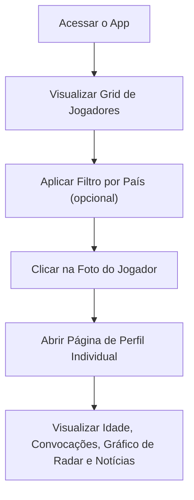

## 1. Visão Geral do Produto
Um "Data App" interativo e completo que exibe as 10 melhores seleções masculinas do ranking da FIFA (Atualizado) e os 3 jogadores mais convocados de cada uma desde a Copa do Mundo de 2022.
- O público-alvo são fãs de futebol, jornalistas e entusiastas esportivos.
- O design é focado em um grid visual impactante com perfis individuais detalhados para cada jogador, incluindo gráficos de desempenho.

## 2. Funcionalidades Principais

### 2.1 Módulos de Funcionalidade
1. **Grid de Jogadores e Seleções**: Interface com fotos clicáveis dos jogadores, organizados por suas respectivas seleções no Top 10 da FIFA.
2. **Filtros Interativos**: Sistema de filtragem por país/seleção para facilitar a navegação no grid.
3. **Páginas de Perfil Individuais**: Ao clicar em um jogador, o usuário é direcionado para uma página com estatísticas detalhadas e gráficos.

### 2.2 Detalhes das Páginas
| Nome da Página | Nome do Módulo | Descrição da Funcionalidade |
|----------------|----------------|-----------------------------|
| Principal (Home) | Grid e Filtros | Grid de fotos clicáveis com botões ou dropdown para filtrar por seleção. |
| Perfil do Jogador | Dados do Jogador | Exibe a foto atual, idade, histórico recente de convocações, notícias em tempo real, desempenho no clube atual e um gráfico de radar de habilidades. |

## 3. Processo Principal

## 4. Design da Interface do Usuário

### 4.1 Estilo de Design
- **Estética**: Design limpo e moderno, focado em imagens (fotos dos jogadores), usando Tailwind CSS para tipografia e espaçamento.
- **Cores Primárias**: Fundo neutro (branco ou cinza muito claro) para destacar as fotos dos jogadores e cores das seleções.
- **Tipografia**: Fontes legíveis e modernas (ex: Inter ou Roboto).

### 4.2 Visão Geral do Design da Página
| Nome da Página | Nome do Módulo | Elementos de UI |
|----------------|----------------|-----------------|
| Principal | Filtros | Botões em formato de "pílula" (pill) para cada país. |
| Principal | Grid | Layout responsivo em CSS Grid, fotos cobrindo o card, efeito hover de zoom suave. |
| Perfil | Cabeçalho | Foto grande do jogador, nome, idade e escudo do clube/seleção. |
| Perfil | Corpo (Dados) | Gráfico de Radar (atributos do jogador), tabelas de convocações, estatísticas do clube e feed de notícias. |

### 4.3 Responsividade
- **Desktop e Mobile**: O grid ajusta automaticamente o número de colunas. A página de perfil empilha as seções verticalmente em dispositivos móveis, ajustando o tamanho do gráfico de radar.
