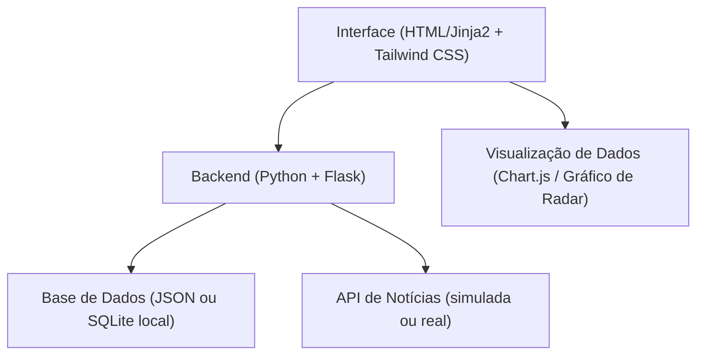

## 1. Arquitetura do Sistema


## 2. Descrição da Tecnologia
- **Backend**: Python 3 com Flask (framework web leve).
- **Frontend**: Templates Jinja2 nativos do Flask estilizados com Tailwind CSS (via CDN ou build local).
- **Gráficos**: Chart.js (ou biblioteca similar via CDN) para renderizar os Gráficos de Radar de estatísticas de cada jogador no frontend.
- **Dados**: Arquivo JSON estático ou banco SQLite contendo as seleções, jogadores, convocações, estatísticas do clube e atributos para o gráfico de radar (ex: Ataque, Defesa, Velocidade, Passe, Físico).
- **Notícias**: Integração com API de notícias esportivas ou mock local de notícias em tempo real.

## 3. Definições de Rotas
| Rota | Propósito |
|------|-----------|
| `/` | Rota principal, exibe o grid de jogadores e os filtros por seleção. |
| `/player/<id>` | Rota da página de perfil individual, carrega dados específicos (convocações, clube, radar chart, notícias). |

## 4. Modelo de Dados

### 4.1 Entidades Principais
```python
# Exemplo do modelo de dados do Jogador
{
  "id": "mbappe_fra",
  "name": "Kylian Mbappé",
  "country": "França",
  "age": 27,
  "photo_url": "...",
  "club": "Real Madrid",
  "attributes": {
    "Pace": 97,
    "Shooting": 90,
    "Passing": 80,
    "Dribbling": 92,
    "Defending": 36,
    "Physical": 78
  },
  "club_performance": {
    "goals": 24,
    "assists": 10,
    "matches": 30
  },
  "recent_callups": [
    {"date": "2026-03-24", "match": "França x Itália", "status": "Titular"}
  ],
  "news": [
    {
      "title": "Mbappé decide o jogo contra a Itália", 
      "date": "2026-04-05", 
      "source": "L'Equipe",
      "url": "https://www.lequipe.fr/mbappe-decide"
    }
  ]
}
```
